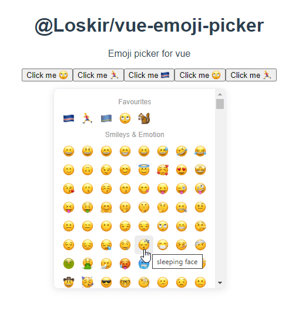

# @Loskir/vue-emoji-picker



## Demo 
[repo](https://github.com/Loskir/vue-emoji-picker-example), [website](https://loskir.github.io/vue-emoji-picker-demo)

## Installation

```shell script
yarn add @loskir/vue-emoji-picker
```
or
```shell script
npm i --save @loskir/vue-emoji-picker
```

## Features
- Fast. Instant wakeup.
- Efficient. Uses intersection observer to render only emojis that are visible
- Uses Apple emojis via [@loskir/emoji-sprite-stylesheet](https://npmjs.com/package/@loskir/emoji-sprite-stylesheet)
- Saves favourite emojis in local storage